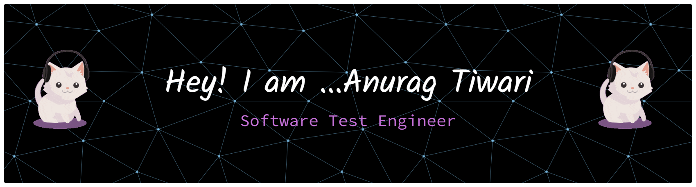

<!-- Banner -->

  

  
  
  
  

  

---

<!-- Typewriter Animation -->
<h2 align="center">
  
</h2>

## 🌟 About Me  
- 🔭 Currently working on **Web Automation** with Playwright & Selenium  
- 👯 Looking to collaborate on **Playwright projects**  
- 💬 Ask me about: **Manual Testing, QA Processes, Agile, Selenium, Playwright, API Testing, SQL**  
- 📫 Reach me at: **anuragtiwari21996@gmail.com**  
- ⚡ Fun Fact: *“For me, every bug is a story, and every fix is a happy ending.”*  

---

## 🖥️ Languages & Other Tools

<!-- Languages -->

<!-- Automation Tools -->

<!-- API & Project Tools -->

<!-- Database -->

<!-- Version Control & DevOps -->

---

## 🏆 GitHub Trophies  

  

---

## 🎯 Currently Learning  

  
  

---

## 🔥 GitHub Stats & Activity  

  
  

  

---

## 💡 Fun Facts & Hobbies
- Coding mini automation projects in free time  
- Reading new trends in automation world & software quality  
- Playing PC games sometimes  

---

## ✨ Quote that inspires me  
> *"Testing is not about finding bugs, it’s about building confidence in the product."*  
